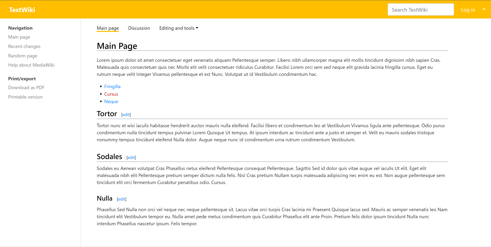

# Medik

_MediaWiki skin for WikiSkripta.eu._

The Medik skin is a simple Bootstrap-based skin originally created for
[WikiSkripta](https://www.wikiskripta.eu).

## Installation

* Download and place the file(s) in a directory called Medik in your `skins/`
  folder.
* Add the following code at the bottom of your `LocalSettings.php`:

      wfLoadSkin( 'Medik' );

* Done - Navigate to `Special:Version` on your wiki to verify that the skin is
  successfully installed.

## Customization

### Global settings

#### Mobile sitename

If your wiki's name is very long, you can define a shorter one for the mobile
screen. Insert this setting to your `LocalSettings.php`:

    $wgMedikMobileSitename = 'ShortWiki';

If the short sitename is not set, it is the same as your `$wgSitename`
by default.

#### Theme color

It is possible to set the color theme by inserting `$wgMedikColor` to your
`LocalSettings.php`:

    $wgMedikColor = '#FF0000';
    
Possible values are either hex values of HTML colors, or named values as used
in CSS.

    $wgMedikColor = 'blue';
    
Default value is `#ffbe00` as used in WikiSkripta project.

#### Site logo

By default, the site logo is not shown at all. But if you want to show your
logo with this skin, you can place it:

- in the upper main bar next to the site title,
- in the sidebar as usual in other skins like Monobook, Vector.

You just have to set `$wgMedikShowLogo` in your `LocalSettings.php`:

    $wgMedikShowLogo = 'main';    // for a small logo (28×28 px) in the main bar
    $wgMedikShowLogo = 'sidebar'; // for big logo in the sidebar

But don't forget to set the logo path at `$wgLogo`!

The default value is `'none'`.

Additionaly, if you have `$wgMedikShowLogo = 'main';`, you can specify these:

    // change the logo width (default is square about 28×28 px)
    $wgMedikLogoWidth = '210px';
    
    // use only logo without text (i.e. without site name)
    $wgMedikUseLogoWithoutText = true;

#### Responsive skin

Note that this skin is responsive by default, i.e. it fits the screen both on
deskops and on mobile screens. If you need unresponsive design, just set in
`LocalSettings.php`:

    $wgMedikResponsive = false;

#### Content width

At large screens, the main content container (with articles, texts, etc.) is
9/12 of the screen width and sidebar menu takes 2/12 of the screen width. It
means that 1/12 of the screen width on the right side remains white. This is
the default and looks good.

But there can be cases when you need your wiki to extend to the full width of
the screen even on the large screens. Then you can use `$wgMedikContentWidth`
variable in your `LocalSettings.php` and set that to `full`:

    $wgMedikContentWidth = 'full';

Then the main content container will take 10/12 of the screen width (and 2/12
remain for the sidebar menu).

### User settings

#### Basic font size

Every user is able to change the default font size in their user settings. It's
found in `Special:Preferences` under the skin preferences.

## Contributing

You can contribute to the original git repository:

    https://bitbucket.org/wikiskripta/medik/

## License

Created by Petr Kajzar, 1st Faculty of Medicine, Charles University, 2019–2021.

This skin is:

* based on [Skin:Example](https://www.mediawiki.org/wiki/Skin:Example)
  (provided under CC0 license),
* using [Bootstrap](https://getbootstrap.com/) (provided under MIT license),
* using [popper.js](https://popper.js.org/) (provided under MIT license),
* created for [WikiSkripta](https://www.wikiskripta.eu) medical wiki,
* and released under Creative Commons Zero v1.0 Universal license.

To the extent possible under law, I have dedicated all copyright and related
and neighboring rights to this software to the public domain worldwide. This
software is distributed without any warranty.

For additional info please refer to the [COPYING file](COPYING).
